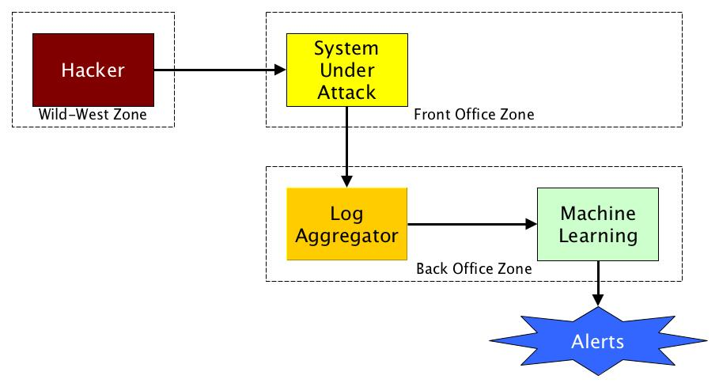

# Overview

The idea of the project is to create a potentially vulnerable system, attack it using a variety of typical hacker tools,
and analyse the resulting log files to see whether alerts can be generated when particular attack patterns are recognised.



Our initial approach is to set up an environment within Amazon Web Services (AWS) where we can isolate the hacker tools so they
have no way to attack systems on the public Internet, only our system under test (in a separate subnet). We're installing
Kali Linux and and OWASP's ZAP as attacking systems. WordPress and optionally RocketChat will act as the systems under attack.
Splunk is used as the log aggregator (subsequently possibly ELK). A machine learning system remains to be identified.

# AWS configuration

* VPC configuration `vpc-91d1bbfa` with 3 subnet:
    1. Public subnet for attacker: `subnet-65037428`
    1. Public subnet for splunk: `subnet-04d4e26f`
    1. Private subnet for hacker: `subnet-04d4e26f`
* Server configured:
    * NAT server
    * Jump Server 
    * OSWAP Zap
    In order to connect with Oswap Zap server you need to perform the following steps
    ```
    $ ssh-agent
    $ ssh-add .ssh/hackstop.pem
    $ ssh -L 3389:10.0.1.67:3389 ec2-user@18.197.122.197
    ```
    after remote desktop (rdp) to `localhost`
    * Kali Linux
    Connection with kali linux in this way:
    ```
    $ ssh-agent
    $ ssh-add .ssh/hackstop.pem
    $ ssh ec2-user@18.197.122.197
    [jump server]$ ssh -i .ssh/hackstop.pem ec2-user@10.0.1.137 
    ```
    * Splunk 
    * Kubernetes cluster
* Kubernetes cluster:
    * Api Node: `api.firstinstall...`
    ```
    $ssh admin@18.195.49.153
    ```
    * Worker Nodes:
        * Node 1
        ```
        $ssh admin@35.159.0.23
        ```
    * Node 2 *(maybe will be started)*

## Installation of kubernetes console
Reference documentation for the console: [Kubernetes console](https://kubernetes.io/docs/tasks/access-application-cluster/web-ui-dashboard/)

Installation command:
```
kubectl create -f https://raw.githubusercontent.com/kubernetes/dashboard/master/src/deploy/recommended/kubernetes-dashboard.yaml
```

Accessing the console, the simplest way is to use kubernetes proxy
```
kubectl proxy
```
and after going to the following link [http://localhost:8001/api/v1/namespaces/kube-system/services/https:kubernetes-dashboard:/proxy/](http://localhost:8001/api/v1/namespaces/kube-system/services/https:kubernetes-dashboard:/proxy/).


# Setup Commands for AWS etc on Macintosh

See [Macintosh Setup](MacintoshSetup.md)

# Maintaining this Project

## Coding Tools

IntelliJ IDEA (Community Edition or Ultimate Edition) - download from https://www.jetbrains.com/idea/download -
is used for code and also UML diagrams using the built-in plugin in the Ultimate Edition.

For those without access to the ultimate edition, there is a Chrome extension called Zen UML - https://www.zenuml.com.
WebSequenceDiagrams is particularly for creating sequence diagrams in a variety of styles - https://www.websequencediagrams.com/.
There are also third-party plug-ins for IDEA, such as PlantUML - https://plugins.jetbrains.com/plugin/7017-plantuml-integration.

## General Diagramming Tools

To view / edit diagrams, use yEd (https://www.yworks.com/downloads#yEd)

## Other Tools

To edit textual documents and presentations, use MS Office.

